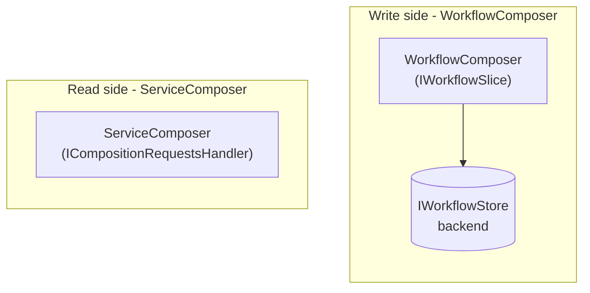

# WorkflowComposer

A small library that composes in-flight workflow state from per-service-boundary contributions, and submits the completed workflow as one transactional bundle.

WorkflowComposer is the write-side companion to [ServiceComposer](https://github.com/ServiceComposer/ServiceComposer.AspNetCore). Where ServiceComposer fans an HTTP read out to many handlers and merges their responses, WorkflowComposer lets each service boundary contribute a slice of the workflow's in-flight state to a shared store, and at workflow-completion time hands a bag of per-boundary commands to a transactional outbox so they all dispatch atomically.

## Why this exists

A multi-page checkout flow needs somewhere to keep the user's in-flight choices: cart items, billing address, shipping address, delivery option, payment token. Without a coordinator, every service boundary either writes its slice to a per-boundary cache (read-your-writes is racy and the slices diverge) or to its own domain database before the user has actually committed to anything (now boundary state has uncommitted "draft" rows).

WorkflowComposer keeps that in-flight state in one place, owned by IT/OPS rather than any of the domain boundaries. The domain boundaries only see committed truth; the workflow store handles drafts.

## Two responsibilities, one library

1. **Slice storage.** Each service boundary contributes an `IWorkflowSlice<TSlice>`. The slice's typed payload (e.g. `CartSlice`, `BillingAddressSlice`) is whatever the boundary wants to write. The framework serialises and stores it, keyed by `(workflowId, sliceKey)`.
2. **Atomic submit.** When the workflow completes, the framework reads every registered slice, asks each boundary to translate its slice into a command, and hands the bag of commands to the store. The SQLite backend commits the workflow row and the outbox messages in one transaction (NServiceBus TransactionalSession + outbox).



Both libraries are populated by per-boundary contributions, both run in IT/OPS hosts, and neither knows anything about domain shapes.

## What's in the box

- **`WorkflowComposer`** (core): `IWorkflowStore`, `IWorkflowSlice`, `IWorkflowSubmitter`, DI helpers. No transport or storage dependencies.
- **`WorkflowComposer.Sqlite`** (backend): `SqliteWorkflowStore`. Slice writes are plain SQLite UPSERTs. Submit uses NServiceBus TransactionalSession against the same SQLite file so the workflow row and the outgoing messages commit together.

Future backends (Redis, Postgres, etc.) plug in by implementing `IWorkflowStore` with their own transactional primitives.

## How a boundary contributes a slice

```csharp
// In Catalog.ServiceComposition

public record CartSlice(IReadOnlyList<CartItem> Items);

public class CartWorkflowSlice : WorkflowSlice<CartSlice>
{
    public override string SliceKey => "Catalog.Cart";

    protected override object BuildSubmitCommand(Guid orderId, CartSlice slice) =>
        new SubmitOrderItems
        {
            OrderId = orderId,
            Items = slice.Items.Select(i => new OrderItem
            {
                ProductId = i.ProductId,
                Quantity = i.Quantity
            }).ToList()
        };
}
```

The boundary's HTTP handlers (registered with ServiceComposer) read and write the slice via `IWorkflowStore`:

```csharp
public class ShoppingCartAddItemHandler(IWorkflowStore store) : ICompositionRequestsHandler
{
    [HttpPost("/cart/addproduct/{orderId}")]
    public async Task Handle(HttpRequest request)
    {
        var input = await request.Bind<...>();
        var ct = request.HttpContext.RequestAborted;

        var cart = await store.Read<CartSlice>(orderId, "Catalog.Cart", ct)
                   ?? new CartSlice([]);
        var updated = cart with { Items = Upsert(cart.Items, input) };
        await store.Write(orderId, "Catalog.Cart", updated, ct);
    }
}
```

No DbContext, no SQL, no NServiceBus. The handler doesn't know what backs the store - swap to Redis tomorrow and the handler is unchanged.

## How submit works

A single handler in IT/OPS triggers the fan-out:

```csharp
public class WorkflowSubmitHandler(IWorkflowSubmitter submitter) : ICompositionRequestsHandler
{
    [HttpPost("/buy/summary/{orderId}")]
    public async Task Handle(HttpRequest request)
    {
        var orderId = ...;
        await submitter.Submit(orderId, request.HttpContext.RequestAborted);
    }
}
```

Inside `Submit`, the framework reads every registered slice, asks each one for its command, and hands the bag to the store. The SQLite store opens a TransactionalSession, sends each command through it, marks the workflow as submitted, and commits. The processor endpoint dispatches the queued messages after commit.

If the gateway crashes mid-commit, nothing was written and nothing was sent - the user retries. If the gateway crashes after commit, the outbox dispatcher delivers the queued commands on next run.

## What WorkflowComposer doesn't do

- **It is not a saga.** Sagas coordinate long-running business transactions across boundaries with compensations. WorkflowComposer just stores in-flight workflow state and dispatches a bundle of commands once. Anything more complex belongs in a saga downstream.
- **It does not give you cross-boundary atomicity at any other point.** Each per-page slice write commits on its own. Only the final submit is transactional, and even that is "all-the-commands-go-out-or-none-do," not "all-the-receivers-succeed."
- **It is not a replacement for per-boundary persistence.** Once a boundary endpoint receives its command, it writes its own DB and publishes its own events using its own outbox. WorkflowComposer is purely about the in-flight workflow.

## Further reading

- [`concepts.md`](concepts.md) - the three interfaces in detail and the lifetimes that fall out.
- [`getting-started.md`](getting-started.md) - the minimum wiring to get a slice writing and submitting.
